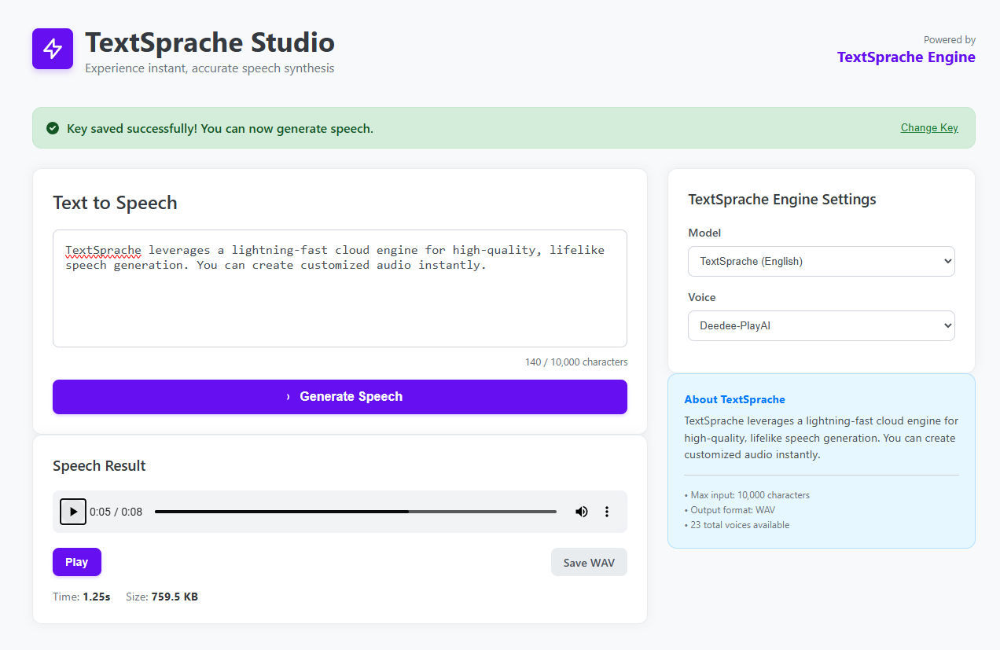

# 🗣️ TextSprache Studio



**TextSprache Studio** (German for "Text Speech") is a lightning-fast, modern web interface for Text-to-Speech (TTS) generation. This application utilizes a Python Flask backend to proxy requests to the high-speed Groq TTS service, providing users with a beautiful, responsive frontend to quickly generate and download high-quality audio.

The modern, light-themed frontend is built with pure HTML, CSS, and JavaScript for maximum simplicity and speed.

## ✨ Features

* **Lightning-Fast Generation:** Leveraging the speed of Groq's API for sub-second audio generation.
* **Secure API Key Handling:** The user's processing key is stored locally in the browser's Local Storage and never permanently saved on the server.
* **Modern UI/UX:** An elegant, clean, and responsive light theme inspired by top-tier modern web applications.
* **Multi-Language Support:** Supports both English and Arabic TTS models with multiple voices for each.
* **Performance Metrics:** Displays generation time and final audio file size upon completion.
* **Output Format:** Generates high-quality WAV audio files ready for playback and download.

## 🏗️ Architecture and Data Flow

The application follows a standard client-server architecture where the Flask backend acts as a secure intermediary between the client's browser and the Groq TTS API.

### Technical Stack

| Component | Technology | Role |
| :--- | :--- | :--- |
| **Frontend** | HTML5, CSS3, JavaScript | User interface, key management (Local Storage), and AJAX requests. |
| **Backend** | Python, Flask | Serves static files, handles the `POST` request, initializes the Groq client, and proxies the TTS request. |
| **TTS Engine** | Groq Python SDK | Executes the Text-to-Speech generation request. |

### Generation Flow (Mermaid Diagram)

This diagram illustrates the secure, key-proxied process of generating audio.

```mermaid
graph TD
    subgraph Client (Browser)
        A[1. User Enters Text & Clicks Generate] --> B(2. script.js: Reads Key from LocalStorage);
        B --> C{3. POST /api/generate-speech};
    end
    
    subgraph Flask Server (app.py)
        C --> D[4. Receives Text, Model, Voice & User Key];
        D --> E(5. Initializes Groq Client with User Key);
        E --> F[6. Sends TTS Request to Groq Cloud];
    end
    
    subgraph Groq Cloud (TTS Service)
        F --> G[7. Generates WAV Audio Data];
        G --> H[8. Sends WAV Data to Flask Server];
    end
    
    subgraph Flask Server (app.py)
        H --> I{9. Streams Audio File to Browser};
    end
    
    subgraph Client (Browser)
        I --> J[10. Receives WAV Data];
        J --> K[11. Displays Audio Player & Download Link];
    end
```


## 📋 Prerequisites

- Python 3.8+
- Groq API key (get one at https://console.groq.com/ - FREE tier available!)
- Modern web browser

## ⚙️ Installation

1. Clone the repository:
```bash
git clone https://github.com/yourusername/groq-tts-playground.git
cd groq-tts-playground
```

2. Install dependencies:
```bash
pip install -r requirements.txt
```

3. No .env file needed! Users enter their API keys in the frontend.

## 🎯 Usage

4. Start the Backend Server

```bash
python backend.py
```

You should see:
```
🚀 Starting Groq TTS Server...
📝 Server running on: http://localhost:5000
💡 Users will provide their own API keys through the frontend
```

## 🎨 Available Voices

### English (playai-tts)
- **Female**: Arista, Celeste, Cheyenne, Deedee, Gail, Indigo, Mamaw
- **Male**: Atlas, Basil, Briggs, Calum, Chip, Cillian, Fritz, Mason, Mikail, Mitch, Quinn, Thunder

### Arabic (playai-tts-arabic)
- **Male**: Ahmad, Khalid, Nasser
- **Female**: Amira

## 🔒 Security Features

1. **API Key Storage**: Stored only in browser's LocalStorage
2. **No Server-Side Storage**: API keys never saved on backend
3. **Client-Side Validation**: Key format validated before use
4. **HTTPS Ready**: Deploy with SSL for production

## 📈 Performance Metrics

| Metric | Value |
|--------|-------|
| Average Generation Time | 0.5-1.5s |
| Max Text Length | 10,000 chars |
| Audio Format | WAV (16kHz) |
| Typical File Size | 100-500 KB |
| Supported Languages | English, Arabic |

## 🤝 Contributing

Contributions welcome! Please:

1. Fork the repository
2. Create a feature branch (`git checkout -b feature/amazing-feature`)
3. Commit changes (`git commit -m 'Add amazing feature'`)
4. Push to branch (`git push origin feature/amazing-feature`)
5. Open a Pull Request

